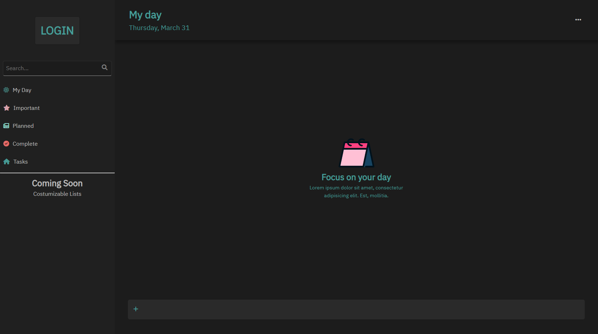

## Microsoft Todolist Clone

  

I have cloned Microsoft Todolist with pure HTML, CSS, JAVASCRIPT 🦾 At this moment it's on demo , I have created a list that show what feature with be added 👏

### Features 📈 :

 - Fully Responsive Layout with FlexBox
 - Creating & Deleting task
 - Saving Tasks information in Local Storage
 - Login Page and profile sections with profile picture (all the data will be saved in Local Storage)

### Features that will be add on other updates 📰

- [ ] Using the Lists

- [ ] Creating custom list

- [ ] Checking the task and adding it to important

- [ ] Sorting tasks

- [ ] Task Customization Section

- [ ] Custom Context Menu on tasks

- [ ] Custom Theme

- [ ] Editing profile data

- [ ] Editing Task info

- [ ] Layout button for changing the task container to grid

- [ ] Adding audio for some actions

- [ ] Adding Key binds

## Desktop View

  

## Mobile View

  

## license & copyright

  

© Iric Gorgi
Licensed under the [MIT Licensed](LICENSE).